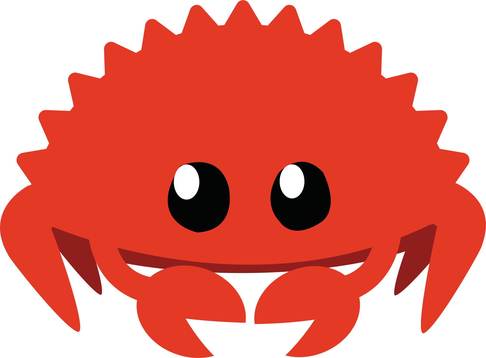

### Hello, I'm Yuri Braga 👋

- 🌱 Currently into CS50 course
- 🐍 Learning python for Data Science applications
- 🦀 Into Rust for personal interest learning CS fundamentals
- 🐳 Interested in containerizations
- 🧪 Chemist by formation

### Interests
| JS | Python | Rust |
|-----------|-----------|----------|
|  |  | |

| conda | VSCode | docker | K8s | git |
|----------|----------|----------|----------|----------|
|  |  |  |  |  |

<!-- Status -->
<picture>
<source 
  srcset="https://github-readme-stats.vercel.app/api?username=bragasgambit&show_icons=true&theme=dark"
  media="(prefers-color-scheme: dark), (prefers-color-scheme: no-preference)"
/>
<source
  srcset="https://github-readme-stats.vercel.app/api?username=bragasgambit&show_icons=true"
  media="(prefers-color-scheme: light)"
/>

</picture>

<!-- Top Langs -->
<picture>
<source 
  srcset="https://github-readme-stats.vercel.app/api/top-langs/?username=bragasgambit&show_icons=true&theme=dark"
  media="(prefers-color-scheme: dark), (prefers-color-scheme: no-preference)"
/>
<source
  srcset="https://github-readme-stats.vercel.app/api/top-langs/?username=bragasgambit&show_icons=true"
  media="(prefers-color-scheme: light)"
/>

</picture>

<!-- Snake grid -->
<picture align="center">
  <source
    media="(prefers-color-scheme: dark)" srcset="https://raw.githubusercontent.com/platane/platane/output/github-contribution-grid-snake-dark.svg" />
  <source
    media="(prefers-color-scheme: light)" srcset="https://raw.githubusercontent.com/platane/platane/output/github-contribution-grid-snake.svg" />
  
</picture>
