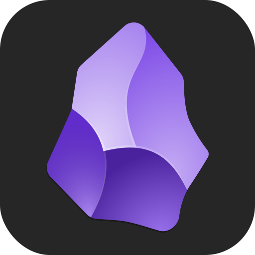

<h3 align="center">Hello 👋</h3>

- 🌱 Currently into CS50 course
- 🐍 Into Python for Data Science
- 🦀 Into Rust
- 🐳 Into Containerization & Orchestration  
- 🧪 BSc Chemistry - UnB & MSc Organic Chemistry - UNICAMP

<h4 align="right">“<em>If you wish to make an apple pie from scratch, you must first invent the universe”</em><br>Carl Sagan</h4>

<!-- Insert bash (.sh) in .md files
```sh
brew install deno
```
-->

<h3>Interests</h3>

<a href="https://arc.net/" target="_blank"></a> &nbsp; &nbsp;
<a href="https://archlinux.org/" target="_blank"></a> &nbsp; &nbsp;
<a href="https://argoproj.github.io/" target="_blank"></a> &nbsp; &nbsp;
<a href="https://aws.amazon.com/" target="_blank"></a> &nbsp; &nbsp;
<a></a> &nbsp; &nbsp;
<a href="https://debian.org/" target="_blank"></a> &nbsp; &nbsp;
<a href="https://deno.com/" target="_blank"></a> &nbsp; &nbsp;
<a href="https://docker.com/" target="_blank"></a> &nbsp; &nbsp;
<a href="https://git-scm.com/" target="_blank"></a> &nbsp; &nbsp;
<a href="https://brew.sh/" target="_blank"></a> &nbsp; &nbsp;
<a href="https://javascript.com/" target="_blank"></a> &nbsp; &nbsp;
<a href="https://kubernetes.io/" target="_blank"></a> &nbsp; &nbsp;
<a href="https://neovide.dev/" target="_blank"></a> &nbsp; &nbsp;
<a href="https://obsidian.md/" target="_blank"></a> &nbsp; &nbsp;
<a href="https://pola.rs/" target="_blank"></a> &nbsp; &nbsp;
<a href="https://postman.com/" target="_blank"></a> &nbsp; &nbsp;
<a href="https://python.org/" target="_blank"></a> &nbsp; &nbsp;
<a href="https://rust-lang.org/" target="_blank"></a> &nbsp; &nbsp;
<a href="https://code.visualstudio.com/" target="_blank"></a> &nbsp; &nbsp;
<a href="https://warp.dev/" target="_blank"></a>

&nbsp;

<!-- Status
<picture>
  <source
    srcset="https://github-readme-stats.vercel.app/api?username=bragasgambit&show_icons=true&theme=dark"
    media="(prefers-color-scheme: dark), (prefers-color-scheme: no-preference)"/>
  <source
    srcset="https://github-readme-stats.vercel.app/api?username=bragasgambit&show_icons=true"
    media="(prefers-color-scheme: light)"/>
  
</picture>
-->

<!-- Top Langs
<picture>
  <source
    srcset="https://github-readme-stats.vercel.app/api/top-langs/?username=bragasgambit&show_icons=true&theme=dark&layout=compact"
    media="(prefers-color-scheme: dark), (prefers-color-scheme: no-preference)"/>
  <source
    srcset="https://github-readme-stats.vercel.app/api/top-langs/?username=bragasgambit&show_icons=true&layout=compact"
    media="(prefers-color-scheme: light)"/>
  
</picture>
-->
<!-- Snake grid
<picture align="center">
  <source
    media="(prefers-color-scheme: dark)" srcset="https://raw.githubusercontent.com/platane/platane/output/github-contribution-grid-snake-dark.svg"/>
  <source
    media="(prefers-color-scheme: light)" srcset="https://raw.githubusercontent.com/platane/platane/output/github-contribution-grid-snake.svg"/>
  
</picture>
-->
