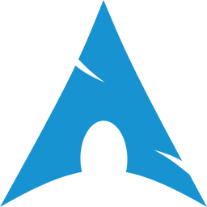

<h3 align="center">Hello 👋</h3>

- 🌱 Currently into CS50 course
- 🐍 Learning Python for Data Science applications
- 🦀 Into Rust for personal interest learning CS fundamentals
- 🐳 Into Containerization & Orchestration  
- 🧪 BSc Chemistry - UnB & MSc Organic Chemistry - UNICAMP

<h4 align="right">“<em>If you wish to make an apple pie from scratch, you must first invent the universe”</em> Carl Sagan</h4>

<h3>Interests</h3>

 &nbsp; &nbsp;
 &nbsp; &nbsp;
 &nbsp; &nbsp;
 &nbsp; &nbsp;
 &nbsp; &nbsp;
 &nbsp; &nbsp;
 &nbsp; &nbsp;
 &nbsp; &nbsp;
 &nbsp; &nbsp;
 &nbsp; &nbsp;
 &nbsp; &nbsp;
 &nbsp; &nbsp;
 &nbsp; &nbsp;
 &nbsp; &nbsp;

&nbsp;

<!-- Status -->
<picture>
  <source
    srcset="https://github-readme-stats.vercel.app/api?username=bragasgambit&show_icons=true&theme=dark"
    media="(prefers-color-scheme: dark), (prefers-color-scheme: no-preference)"/>
  <source
    srcset="https://github-readme-stats.vercel.app/api?username=bragasgambit&show_icons=true"
    media="(prefers-color-scheme: light)"/>
  
</picture>

<!-- Top Langs -->

<picture>
  <source
    srcset="https://github-readme-stats.vercel.app/api/top-langs/?username=bragasgambit&show_icons=true&theme=dark&layout=compact"
    media="(prefers-color-scheme: dark), (prefers-color-scheme: no-preference)"/>
  <source
    srcset="https://github-readme-stats.vercel.app/api/top-langs/?username=bragasgambit&show_icons=true&layout=compact"
    media="(prefers-color-scheme: light)"/>
  
</picture>

<!-- Snake grid -->
<picture align="center">
  <source
    media="(prefers-color-scheme: dark)" srcset="https://raw.githubusercontent.com/platane/platane/output/github-contribution-grid-snake-dark.svg"/>
  <source
    media="(prefers-color-scheme: light)" srcset="https://raw.githubusercontent.com/platane/platane/output/github-contribution-grid-snake.svg"/>
  
</picture>
